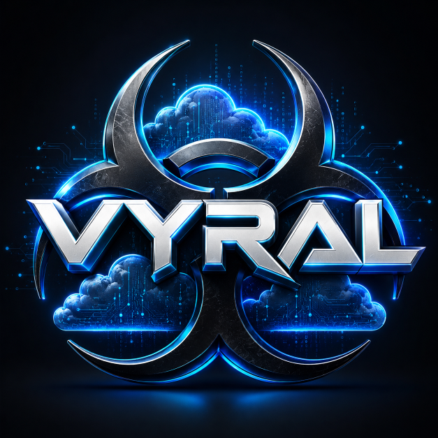

<p align="center">
  <a href="https://openvyral.com/">
    
  </a>
</p>

<h1 align="center">Vyral</h1>

<p align="center">
  <strong>Own the contract layer.</strong><br>
  Provider-portable records, retrieval, durable execution, and AI runs.
</p>

<p align="center">
  Build locally. Change providers without rewriting your application.
</p>

<p align="center">
  <a href="https://openvyral.com/">Website</a> ·
  <a href="https://docs.openvyral.com/">Documentation</a> ·
  <a href="ROADMAP.md">Roadmap</a>
</p>

Vyral is an open-source, local-first contract layer and runtime for applications
that need **records and objects**, **retrieval and RAG**, **durable work**, and
**provider-backed AI runs**. It keeps those capabilities behind stable,
application-owned contracts instead of vendor SDKs.

Start on a laptop with one command. When economics, features, policy, or scale
change, adapters can move individual capabilities to SQLite,
Postgres/pgvector, Azure, AWS, Google Cloud, Cloudflare, Temporal, and other
providers without changing application code. Language-neutral conformance
fixtures and a versioned qualification matrix make adapter behavior explicit
instead of assumed.

## Quick start

Try the end-to-end local path from a source checkout:

```bash
./scripts/vyral
```

This is the only command required for the local demonstration. With Python 3.10
or newer—and no package installation, .NET SDK, container runtime, cloud
account, external service, or model download—it runs lexical retrieval with
citations, admits durable work, reopens the runtime, and completes the
preserved run. State remains inspectable under `./.vyral/quickstart`.

Create an editable application when you are ready to build:

```bash
./scripts/vyral init
./scripts/vyral run ./vyral_app.py
```

The runtime command is `vyral`; `vyral-runtime` remains a compatibility alias
and the distribution name. Use `./scripts/vyral inspect` to explain the local
providers and limitations. Windows users can invoke the source launcher with
`python scripts/vyral`. Installation, custom state paths, JSON output, reset,
and server instructions are in the
[Python runtime guide](runtimes/python).

| You need… | Start here |
| --- | --- |
| Try Vyral locally | [Quick start](#quick-start) |
| Choose source-native, lexical, vector, or hybrid retrieval | [Retrieval guide](docs/guides/source-native-retrieval.md) |
| Embed Vyral in Python | [Python runtime](runtimes/python) |
| Connect from Python, JavaScript, or Go | [Runtimes and clients](#choose-a-runtime-or-client) |
| Build durable plugins and workflows | [Execution runtime](#execution-runtime) |
| Inspect adapter maturity | [Qualification report](qualification/adapter-qualification.json) |

## Why Vyral

AI applications often start with a simple local path, then accumulate provider
assumptions: storage shapes, search semantics, object layouts, embedding APIs,
quotas, auth, and SDK-specific envelopes. A provider change becomes a product
rewrite rather than an infrastructure decision.

Vyral keeps the capability model application-owned:

- **Records** — ids, partition keys, metadata, content, sources, vectors, and etags
- **Objects** — large immutable payloads and manifests outside the record index
- **Retrieval** — source-native, lexical, vector, and hybrid search, profiles, and evaluation
- **RAG** — deterministic chunk plans, dry-run/commit, manifests, context, and citations
- **AI runs** — one envelope for local, CLI, ONNX-backed, and remote capabilities
- **Execution** — durable runs and plugins with local and provider-backed adapters
- **Evidence** — readiness, traces, conformance suites, and qualification levels

Vyral is most useful when an application needs to cross one or more provider
seams without giving those providers ownership of its data and execution
semantics.

Vyral does not assume vector search is always the answer. For current,
structured sources that an application can safely access, direct source search
is often the simplest first path. Indexed lexical, vector, hybrid, and reranked
retrieval remain available when corpus shape and measured quality justify them.

## Status

Vyral is an Apache-2.0, pre-1.0 project in active development. Local paths are
usable and tested, but adapter maturity varies and packages have not yet been
published. See the [stability policy](docs/reference/stability.md) for the
compatibility policy.

| Surface | Current posture |
| --- | --- |
| .NET local server, SQLite, retrieval, and RAG | Primary supported implementation |
| Python and JavaScript HTTP clients | Implemented and tested against the public SDK catalog |
| Python-native embedded runtime and REST/MCP host | Prototype; clean-artifact qualified on Python 3.10–3.12 across Linux, macOS, and Windows; independent security review remains |
| Source-native ripgrep integration | Experimental; bounded exact-literal search over authorized code and Markdown, outside the stable wire/MCP contract |
| Stateless MCP `2026-07-28` endpoint | Preview; opt-in and REST-backed |
| Local SQLite and Azure Durable execution | Preview; locally conformant |
| AWS, Google, Temporal, pgvector, and Cloudflare adapters | Preview or prototype; live qualification is opt-in |

A package existing in the repository is not a production-readiness claim. The
[qualification report](qualification/adapter-qualification.json) is the source
of truth for recorded evidence.

## Server and client examples

To exercise the server boundary instead, start the .NET host from the
repository root:

```bash
scripts/start-local-server.sh
```

It listens on `http://127.0.0.1:5220` and writes local state beneath `.vyral/`.
Run either HTTP client example to create a collection, store three documents,
retrieve lexical context without embeddings, and print citations:

```bash
python3 examples/python/rag_quickstart.py
node examples/javascript/rag-quickstart.mjs
```

Set `VYRAL_URL` to use a different host. More complete retrieval, GraphRAG, AI,
and execution examples live in [examples](examples) and [samples](samples).

### Container

The server image is non-root, shell-free, and compatible with a read-only root
filesystem. This local command keeps state in a Docker-managed volume:

```bash
docker build -t vyral-server .
docker volume create vyral-data
docker run --rm \
  --publish 127.0.0.1:8080:8080 \
  --read-only \
  --mount type=volume,source=vyral-data,target=/app/.vyral \
  --cap-drop ALL \
  --security-opt no-new-privileges=true \
  --pids-limit 256 \
  vyral-server
```

CanonicalStore routes are disabled in the image unless their identity policies
are explicitly configured. Shared deployments should also use an authenticated
ingress and a deployment-managed API key. See
[CanonicalStore guide](docs/concepts/canonical-store.md) and the [deployment guide](deploy).

## Choose a runtime or client

| Goal | Entry point |
| --- | --- |
| Run the full .NET server and provider adapters | `src/Vyral.Server` and packages under `src/` |
| Run Vyral in a Python process | `vyral-runtime` in `runtimes/python` |
| Host REST and MCP from Python | `vyral-runtime[server]` |
| Call a running host from Python | `vyral-client` in `clients/python` |
| Call a running host from JavaScript | `@vyral/client` in `clients/javascript` |
| Implement an external worker in Go | `clients/go` |

The Python runtime is a peer implementation, not a wrapper around .NET. The
Python and .NET runtimes share wire contracts and conformance fixtures, but
their database files and migration histories are private implementation
details. Move data through documented exports and envelopes; do not copy a
SQLite database between runtimes.

OpenAPI is the wire authority. The
[public SDK catalog](contracts/public-sdk-surface.json) maps stable operation
IDs to the Python and JavaScript clients, generated types, MCP surfaces, and
runtime implementations.

## Core capabilities

| Area | What the contract covers |
| --- | --- |
| Records and objects | Partitioned records, metadata, vectors, sources, etags, batches, immutable objects, manifests, and snapshots |
| Retrieval | Structured filters, lexical/vector/hybrid search, fusion, profiles, reranking, diagnostics, and evaluation |
| RAG | Deterministic ingestion, dry-run and durable admission, citations, bounded context, prompts, and GraphRAG expansion |
| Graphs | Import/export, preflight, inspection, doctor, bounded traversal, assertions, reviews, and projections |
| AI runs | Model discovery, capability guidance, extraction, embedding, reranking, quotas, artifacts, and normalized status |
| Durable execution | Idempotent admission, retries, cancellation, timers, waits, checkpoints, artifacts, leases, plugins, and external workers |
| Operations | Health, readiness, traces, redacted diagnostics, conformance, qualification receipts, and release evidence |

The REST host exposes the complete contract at
`/openapi/vyral.json`. Detailed request shapes belong in OpenAPI and the client
documentation rather than being duplicated here.

## Stateless MCP

Vyral implements the MCP `2026-07-28` stateless request/response protocol at
the opt-in `POST /mcp` endpoint. Each request carries its version, routing,
capability, and authorization context in headers. The server creates no MCP
session, so a gateway can route and authorize requests before sending any call
to any healthy instance behind an ordinary load balancer.

Enable the default read/resource catalog on the .NET host:

```bash
Mcp__Enabled=true dotnet run --project src/Vyral.Server/Vyral.Server.csproj
```

Write tools are disabled by default. Enable them by semantic operation ID, for
example:

```bash
Mcp__Enabled=true \
Mcp__EnabledOperationIds__0=startEmbeddingJob \
dotnet run --project src/Vyral.Server/Vyral.Server.csproj
```

Long-running MCP tools return durable task envelopes while Vyral's execution
runtime remains the run authority. Routing headers are never treated as
authorization claims, and binary artifact upload remains REST-only.

Run the frozen official profile plus Vyral's multi-instance, failover, task,
policy, and telemetry fixtures with:

```bash
scripts/verify-mcp-conformance.sh
```

The packaged Python host runs the same frozen official requirements profile in
the Python runtime qualification workflow; its conformance fixtures are enabled
only for that gate.

See the [stateless MCP design](design/public-sdk-surface-and-stateless-mcp.md)
for routing, catalog policy, security boundaries, and acceptance criteria.

## Storage and retrieval

The default local shape uses SQLite for records and traces and the filesystem
for objects. Deployment can select provider adapters without changing consumer
requests:

| Capability | Local default | Available adapters |
| --- | --- | --- |
| Records | SQLite | Firestore, AlloyDB/pgvector, Azure Cosmos DB, DynamoDB |
| Objects | Filesystem | Google Cloud Storage, Cloudflare R2, Azure Blob Storage, S3 |
| Retrieval | SQLite/local providers | pgvector and provider-shaped adapters |
| Traces | SQLite | Firestore and deployment-specific sinks |

Retrieval supports structured filters, lexical, vector, and hybrid modes;
configurable fusion and reranking; reusable profiles; and evaluation receipts.
The deterministic local embedding provider is for mechanics and repeatability,
not semantic quality. ONNX and provider-backed models require explicit model or
credential configuration.

RAG ingestion separates planning from commit, persists manifests, and admits
large mutations through durable execution. RAG context responses preserve
citations, source spans, truncation diagnostics, and stable context hashes.

See [the consumer handoff](docs/guides/consumer-handoff.md) for configuration and failure
interpretation, and [the examples](examples) for working retrieval recipes.

## CanonicalStore

`ICanonicalStore` is Vyral's strong-storage profile for canonical application
state. A tenant-scoped transaction atomically commits documents, immutable
revisions, uniqueness or command fences, outbox events, and its idempotency
receipt—or commits none of them.

Local SQLite, PostgreSQL, and MySQL 8/InnoDB implementations are included.
Consumers retain ownership of document schemas, transformations, projections,
and migrations; CanonicalStore does not promise portable arbitrary SQL or
provider-specific query behavior. See the [CanonicalStore guide](docs/concepts/canonical-store.md)
for the transaction contract, identity policy, export/restore flow, and
deployment configuration.

## Graph and GraphRAG

Vyral imports, exports, and traverses
[ROMAN-compatible graph envelopes](docs/roman.md) through ordinary record
collections. Nodes, edges, source-grounded assertions, reviews, and projections
remain portable records rather than requiring a separate graph database.

Graph import has a non-mutating preflight. Inspection and doctor operations
report graph health and seed coverage. GraphRAG starts with retrieved records,
resolves their graph-node identifiers, performs a bounded traversal, and
returns a projection with provenance and budget diagnostics. Relationships add
context; they do not replace retrieved source evidence.

## AI runs

AI runs normalize model discovery, capability guidance, request status,
artifacts, traces, and quota reporting across local, CLI, ONNX, and remote
providers. Provider-specific behavior stays behind adapter boundaries and is
surfaced through readiness and qualification evidence rather than silent
fallback.

Live credentials and model assets are always opt-in. Local development should
use deterministic fixtures or explicitly installed untracked model files.

## Execution runtime

The execution contract covers admission, status, history, events, progress,
retries, cancellation, timers, waits, checkpoints, artifacts, concurrency
keys, maintenance, and plugin discovery.

Vyral uses two canonical mutation shapes:

- synchronous operations return only after the requested effect is complete;
- receipt-bound asynchronous operations durably admit work and return a run or
  job receipt whose status can be queried independently.

The local SQLite runtime is the reference implementation. Azure Durable,
AWS, Google Cloud Tasks, and Temporal adapters implement different subsets and
carry separate qualification evidence. External workers use leases,
heartbeats, cancellation, and token-safe artifact transport without owning the
execution authority.

Vyral can also sit inside an existing orchestrator without replacing it. The
[Prefect receipt-flow example](examples#prefect-composition) lets
Prefect own schedules, task retries, and operator visibility while Vyral owns
durable admission, status, and results. It is a composition recipe, not a
Prefect adapter or qualification claim.

Start with the [execution design](design/execution-runtime.md),
[admission contract](design/admission-contract.md),
[plugin authoring guide](design/execution-runtime-plugin-authoring.md), and
[current limitations](docs/reference/execution-runtime-limitations.md).

## Adapter qualification

| Area | Current posture |
| --- | --- |
| Local SQLite records, objects, retrieval, and execution | Reference path; deterministic conformance |
| PostgreSQL/pgvector and CanonicalStore | Implemented; live deployment evidence remains environment-specific |
| Azure storage and Durable Functions | Preview; local gates and opt-in live qualification |
| AWS storage and execution | Preview/prototype; opt-in live qualification |
| Google storage and execution | Preview/prototype; opt-in live qualification |
| Temporal coordinator and projection | Prototype; disposable and operator-provisioned qualification gates |
| Cloudflare R2 | Preview object-store adapter |

An adapter is `live_qualified` only when the versioned
[qualification report](qualification/adapter-qualification.json) records the
required receipt. Availability, a successful build, or a package version alone
does not establish that claim. Adapter authors should begin with
[adapter contributor guide](docs/contributing/adapter-contributor.md).

## Repository map

```text
src/           .NET contracts, runtimes, server, and provider adapters
clients/       Python and JavaScript HTTP SDKs; Go external-worker client
runtimes/      Peer runtime implementations, currently Python
contracts/     OpenAPI-derived public SDK catalog and JSON schemas
conformance/   Language-neutral cross-runtime fixtures
examples/      Short HTTP client recipes
samples/       Runnable .NET and execution examples
tests/         Unit, integration, conformance, and adapter suites
qualification/ Versioned adapter qualification report and policy
design/        Contract and runtime designs
docs/          User, contributor, maintainer, and reference documentation
deploy/        Deployment preflights and qualification shapes
packaging/     Shared package landing-page inputs
scripts/       Local start, generation, verification, and release gates
```

## Build and verify

The ordinary deterministic checks are:

```bash
scripts/run-dotnet-tests.sh Vyral.sln

npm ci --ignore-scripts --prefix clients/javascript
npm test --prefix clients/javascript

python3 -m pip install \
  --editable 'clients/python[typecheck]' \
  --editable 'runtimes/python[dev]'
python3 -m unittest discover -s clients/python/tests -p 'test_*.py'
scripts/verify-python-runtime.sh
```

Contract generation and repository-policy checks run in CI. Before treating a
commit as releasable, run the larger artifact and consumer gate:

```bash
scripts/verify-release-artifacts.sh
```

Live provider gates are separate, explicit, and credential-bearing. They are
not part of the default local test suite. Release and publication procedures
are documented in the [release process](docs/maintainers/releasing.md).

## Documentation

| Topic | Document |
| --- | --- |
| Documentation index | [docs/README.md](docs/README.md) |
| Consumer deployment and failure interpretation | [Consumer handoff](docs/guides/consumer-handoff.md) |
| Stability and versioning | [Stability policy](docs/reference/stability.md) |
| Security policy | [SECURITY.md](SECURITY.md) |
| Public SDK and stateless MCP | [design/public-sdk-surface-and-stateless-mcp.md](design/public-sdk-surface-and-stateless-mcp.md) |
| Python runtime | [runtimes/python/README.md](runtimes/python/README.md) and [design/python-runtime.md](design/python-runtime.md) |
| Extropic execution | [Extropic execution guide](docs/guides/extropic-execution.md) |
| Canonical storage | [CanonicalStore guide](docs/concepts/canonical-store.md) |
| Execution runtime | [design/execution-runtime.md](design/execution-runtime.md) |
| Adapter contribution | [Adapter contributor guide](docs/contributing/adapter-contributor.md) |
| Deployment shapes | [deploy/README.md](deploy/README.md) |
| Roadmap | [ROADMAP.md](ROADMAP.md) |

## Current limits

- Vyral is pre-1.0; preview contracts can still change under the documented
  stability policy.
- The Python peer runtime remains a prototype until its remaining promotion
  evidence and independent review are complete.
- Provider behavior is limited to the portable contract; provider-native
  features may require application-owned extensions.
- Local deterministic embeddings validate mechanics, not semantic quality.
- Live provider qualification requires operator-owned infrastructure,
  least-privilege credentials, and explicit execution.
- CanonicalStore is intentionally narrower than a general relational database.
- MCP is opt-in, and write tools require an explicit allowlist.

## Contributing

Read [CONTRIBUTING.md](CONTRIBUTING.md), the
[code of conduct](CODE_OF_CONDUCT.md), and the relevant contract or adapter
design before proposing a change. Public behavior should be represented in
OpenAPI, the SDK catalog, conformance fixtures, and qualification evidence—not
only in one implementation.

## License

Vyral is licensed under [Apache License 2.0](LICENSE). Third-party notices and
project trademark guidance are in [THIRD-PARTY-NOTICES.md](THIRD-PARTY-NOTICES.md)
and [TRADEMARKS.md](TRADEMARKS.md).
