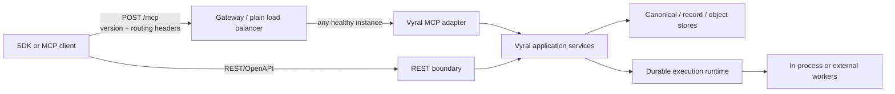

# Public SDK Surface and Stateless MCP Design

**Status:** accepted and implemented

**Date:** 2026-07-29

**Decision scope:** public HTTP contract, Python and JavaScript/TypeScript SDKs, and an additive Model Context Protocol (MCP) server surface.

## Decision

Vyral will treat its public surface as one versioned capability contract, rather
than as a collection of HTTP routes or hand-maintained client wrappers. The
contract is delivered through three compatible entry points:

1. REST/OpenAPI for application and data-plane integration.
2. First-class Python and JavaScript/TypeScript SDKs for the public REST
   capability set.
3. A stateless MCP endpoint for model-facing discovery, read/query, selected
   mutation, and durable-task operations.

REST remains authoritative for all data-plane operations, binary transfer, and
automation. MCP is an additive adapter over Vyral application services; it does
not replace REST, call the server's own HTTP endpoints, or create a second
domain model.

The MCP endpoint will implement the 2026-07-28 stateless model: no protocol
session, no session affinity, no process-local client state, and no reliance on
an `initialize` handshake. It will use `server/discover`, negotiated
per-request metadata, and the HTTP headers required by that MCP revision. A
request may therefore be routed to and executed by any healthy Vyral instance.

This design is based on the MCP 2026-07-28 release material, the final
[stateless-MCP SEP](https://modelcontextprotocol.io/seps/2575-stateless-mcp),
the final [HTTP-header standardization SEP](https://modelcontextprotocol.io/seps/2243-http-standardization),
and the [2026-07-28 transport requirements](https://modelcontextprotocol.io/specification/2026-07-28/basic/transports).

### Implementation record

As of 2026-07-29, the versioned operation catalog classifies all 129 public
operations and the Python and JavaScript/TypeScript package gates enforce that
catalog against OpenAPI, generated types, package contents, and temporary real
servers. The MCP adapter pins `ModelContextProtocol.AspNetCore` and
`ModelContextProtocol.Extensions.Tasks` 2.0.0. Its catalog contains 17 bounded
read/query tools, four resources, and 12 opt-in durable task tools.

`scripts/verify-mcp-conformance.sh` pins the official conformance runner at
`0.2.0-alpha.11` and runs the frozen `--requirements 2026-07-28` profile. All 37
scored server scenarios pass. The runner also retains its 13 extension/pending
diagnostics; those results remain visible but are not represented as part of the
frozen score. In the pinned alpha.11 runner, all functional task-extension checks
pass; its eight failing task diagnostics come solely from the generic core wire
validator treating the extension's `resultType: "task"` envelope as a
`CallToolResult`. The remaining failing diagnostic is a pending JSON-Schema fixture
that Vyral does not claim. The gate sends the official client through a byte-preserving
round-robin proxy to two server processes, records redacted wire/toolchain
evidence, runs bounded concurrent probes, removes one process to prove failover,
and verifies both processes rejoin without session affinity. Vyral integration
fixtures separately cover disabled-by-default deployment, discovery policy,
authentication, execution-policy equivalence, request limits, durable task
cancellation, and cross-instance task/input resumption. The release-artifact
gate invokes this script and the hosted workflow additionally qualifies the
production container.

## Context

Vyral already exposes a substantial HTTP surface: records and objects,
retrieval/RAG/GraphRAG, embeddings and providers, CanonicalStore, traces, and
durable execution. The Python and JavaScript clients closely mirror the common
consumer paths, but the public-support boundary is not explicit or mechanically
enforced. In particular, neither client currently wraps generic multipart
record-artifact ingestion or raising an event into an execution run.

The existing API is intentionally capable of running locally or behind
provider-neutral adapters. Its canonical and execution access layers already
bind verified identities to tenant, product, handler, and operation policies.
That is the correct authorization authority to preserve when traffic arrives
through a gateway or MCP client.

MCP's 2026-07-28 revision changes the deployment model in a useful way:

- `server/discover` replaces the stateful initialization dependency.
- Request protocol/client metadata is present per request instead of being
  retained as connection state.
- HTTP requests carry a protocol-version header; MCP method and tool/resource
  identity can be mirrored in headers.
- Header/body agreement is required, so a gateway can make an early routing
  decision without becoming a second source of truth.

The opportunity is to make Vyral easy to consume from applications and models
while preserving its durable-state, tenant-isolation, idempotency, and
provider-portability guarantees.

## Goals

- Define a complete, stable, and testable public SDK surface for Python and
  JavaScript/TypeScript.
- Close the two present SDK gaps: multipart record-artifact ingestion and
  execution-run event delivery.
- Provide useful static types without forcing a runtime validation dependency.
- Make every public operation traceable to OpenAPI, SDK methods, tests,
  documentation, stability status, and release evidence.
- Add a stateless MCP server that works behind ordinary non-sticky HTTP load
  balancers and gateways.
- Let gateways route, rate-limit, and perform credential-based authorization
  using request headers, while retaining Vyral as the final authorization
  authority.
- Map long-running MCP work to Vyral's durable execution runtime instead of
  holding HTTP connections or storing conversation state in an instance.
- Preserve existing REST behavior and avoid exposing provider SDK types or
  provider-specific policies in public contracts.

## Non-goals

- Replacing REST/OpenAPI with MCP.
- Making every REST route a one-for-one MCP tool. Binary transfer, low-level
  maintenance, and provider-specific administration remain REST operations.
- Introducing sticky sessions, an MCP session store, or instance-local
  authorization state.
- Treating model-supplied metadata, MCP headers, or a tenant identifier as an
  authentication or authorization credential.
- Rewriting the Vyral server in Python or adding a Go HTTP SDK in this effort.
- Promoting current preview/provider-specific capabilities merely because an
  MCP adapter can expose them.

## Public capability contract

### Operation catalog

Add `contracts/public-sdk-surface.json` as the reviewed catalog for public
operations. It is metadata over the existing OpenAPI contract, not a competing
schema language. Each entry contains:

- stable operation id and semantic group;
- REST operation id(s), including any safe route aliases;
- stability: `public`, `preview`, `internal`, or `deprecated`;
- authorization class and mutation/idempotency requirements;
- Python and JavaScript method names;
- request/response schema references;
- MCP exposure: `none`, `tool`, `resource`, or `task`;
- header-safe routing fields, if any; and
- required unit, integration, conformance, and documentation fixtures.

An OpenAPI route is not automatically public. The catalog makes the intended
boundary explicit and prevents an internal maintenance endpoint from being
accidentally generated into a package or listed as an MCP tool.

The catalog describes semantic operations rather than merely path shapes. For
example, canonical document read and revision methods use the existing
body-based routes because opaque IDs may contain path separators. The legacy
path-based routes are documented aliases, not duplicate SDK methods. The root
server banner is intentionally not an SDK operation.

### Schema dialect

The existing OpenAPI document is 3.0.3, while MCP 2026-07-28 tool input and
output schemas use full JSON Schema 2020-12. Hand-maintaining two dialects would
reintroduce the drift this design is intended to remove. Phase 0 therefore:

- moves reusable public models into canonical JSON Schema 2020-12 documents;
- upgrades the public OpenAPI document to 3.1 so it can reference those models
  without a lossy dialect translation; and
- derives MCP tool schemas and SDK contract types from the same versioned model
  documents.

The OpenAPI 3.1 change must pass the existing contract fixtures and the chosen
Python/JavaScript tooling before it becomes the published document. A temporary
3.0 compatibility artifact may be generated for a known consumer, but it is not
an editable source of truth.

### Public surface treatment

| Capability group | REST/OpenAPI | Python and JavaScript SDK | MCP default exposure |
| --- | --- | --- | --- |
| Health, readiness, contract, capability discovery | Public, read-only | Full | Resource/read-only tool |
| Collections, records, objects, retrieval, RAG, GraphRAG | Public subject to store policy | Full | Read/query tools; selected bounded writes |
| Embeddings and provider catalog/qualification | Public subject to provider policy | Full | Catalog/read tools; runs opt-in |
| CanonicalStore | Public only with canonical policy | Full, body-safe identity methods | Disabled by default; explicit tenant/admin policy |
| Execution runtime and job families | Public subject to execution policy | Full | Read/start/task operations; event delivery only when authorized |
| Traces and maintenance | Public only where policy permits | Full | Read-only diagnostics by default; maintenance excluded |
| Generic multipart record-artifact ingest | Public REST operation | Full | REST only; binary upload is not an MCP tool call |

MCP tool exposure is a deployment policy, not a promise that every configured
REST operation is available to every model. `tools/list` must contain only
operations both enabled by configuration and authorized for the authenticated
caller.

### SDK additions and ergonomics

Both SDKs gain the following public operations in the same release:

- Python: `ingest_record_artifact(...)` and JavaScript:
  `ingestRecordArtifact(...)`. They send the documented multipart `manifest`
  and `artifact` parts, stream the artifact where the host runtime supports it,
  accept an explicit filename/content type and idempotency key, return a durable execution run
  carrying the shared admission receipt, and
  never buffer an arbitrary artifact solely to construct JSON.
- Python: `raise_execution_event(run_id, request)` and JavaScript:
  `raiseExecutionEvent(runId, request)`. They call the existing authorized
  execution event route and preserve the route/run-id consistency check.

All public methods use a shared transport/options shape:

- explicit timeout and cancellation support;
- caller-provided headers and request correlation;
- API key or bearer authentication without logging credentials;
- retries only for safe reads or writes carrying an idempotency key;
- normalized REST problem details; and
- bounded page iterators/async iterators in addition to convenience methods
  that collect every page.

The Python package remains dependency-light. Generated `.pyi` stubs and
`TypedDict`/`Literal` contract types provide static checking without changing
runtime validation behavior. An optional `async` transport extra uses `httpx`;
the synchronous standard-library client remains supported. The JavaScript
package retains its Fetch-based runtime and ships generated `.d.ts` declarations
through a `types` package entry. Neither package silently validates or coerces
application payloads differently from the server.

### Contract and versioning rules

- A `public` operation is additive-only within a published contract major.
  Removing a field, narrowing a schema, changing a status vocabulary, or
  changing authorization semantics is a breaking change.
- `preview` operations are opt-in and carry an explicit warning in package docs,
  generated types, and MCP tool annotations. They cannot be promoted without a
  documented compatibility review.
- Deprecated operations remain functional for their announced support window,
  are marked in OpenAPI and SDK docs, and have a replacement operation.
- Package versions, OpenAPI `info.version`, the operation catalog version, and
  the conformance fixture version are released together and recorded in release
  evidence.
- The current `0.x` packages may deliver these changes as preview releases, but
  neither SDK is labeled `1.0` until all acceptance criteria in this document
  pass for the same release commit.

## Stateless MCP architecture

`src/Vyral.Mcp` will host the MCP adapter and reference Vyral abstractions and
application services directly. `Vyral.Server` composes it at `POST /mcp` when
`Mcp:Enabled` is true. The adapter must not make loopback REST calls: that would
duplicate serialization, authentication, and rate-limit behavior and make an
instance-local deployment appear stateless when it is not.

The main endpoint supports the 2026-07-28 stateless protocol revision. It has
no MCP session id, no server-held conversation state, and no `GET`/`DELETE`
session lifecycle. If a legacy MCP transport is later required, it is an
explicitly configured compatibility endpoint with a separate lifecycle and
sunset date; it must not quietly turn `/mcp` into a sticky-session dependency.

The initial endpoint returns one complete response per POST. The pinned C# SDK
may encode that response as a finite Streamable HTTP SSE response when required
by content negotiation, but Vyral does not expose a standalone GET event stream
or retain stream/session state. Long-running work uses durable task/run handles.
Additional request-scoped streaming may be added later if a demonstrated use
case needs it, but it cannot introduce session affinity or state that another
instance cannot resume.

### Request handling sequence

1. The gateway enforces TLS, configured request/header limits, protocol-version
   allowlists, and credential validation. It may route using MCP headers and
   authenticated claims without parsing a JSON-RPC body.
2. The MCP adapter checks the MCP version, required standard headers, header
   encoding, and request size before invoking an operation.
3. The adapter parses the request and validates every mirrored header against
   the method, tool/resource name, and any declared header-safe parameter in
   the body. A mismatch produces the current MCP-defined `HeaderMismatch`
   result and an HTTP 400 response. The exact error code is imported from the
   pinned MCP schema/conformance package rather than copied as a magic number.
4. Vyral authenticates the request and binds a verified principal. Canonical
   and execution policies then authorize the requested tenant, product,
   handler, and operation exactly as they do for REST.
5. The adapter calls the application service, records bounded audit and trace
   data, and returns a protocol-compliant response. Any durable work is stored
   in the execution runtime before the response is returned.

Header values are routing hints and untrusted input. A gateway may authorize a
request after validating its bearer token or mTLS identity, but it must not grant
access merely because `Mcp-Name` or an `Mcp-Param-*` header claims a tenant or
privilege. The Vyral service remains final authority for every data access and
mutation.

### Header policy

The adapter always processes the MCP-required protocol/method/name headers for
the selected protocol revision. The operation catalog may mark a small set of
top-level tool parameters as header-safe via MCP's schema extension. Initial
guidance is deliberately conservative:

- Eligible: a short, ASCII, non-secret routing class or an opaque tenant routing
  key when a deployment needs it and documents its exposure.
- Ineligible: API keys, bearer tokens, lease tokens, idempotency keys, object
  keys, document IDs, query text, prompt contents, raw provider inputs, PII,
  or any high-cardinality diagnostic value.
- Optional header parameters are omitted when absent or null. Values are
  encoded and validated according to the MCP specification, including unsafe or
  non-ASCII values.

Vyral sets its own configurable limits for total MCP-header bytes, header count,
and request body bytes, and fails early with standard HTTP errors such as 431 or
413. The configured limits must be no greater than the lowest deployed gateway
limit. Logs, traces, and metrics record header names and approved low-cardinality
classes only, never raw credentials or arbitrary header values.

### Tool, resource, and task mapping

Tool IDs are stable, explicit-version names such as
`vyral_records_query_v1`; a tool name is never reused for incompatible input or
output. The catalog defines its schema, authorization class, idempotency rule,
and MCP visibility.

- Resources are small, read-only, cacheable material such as the contract,
  server capability summary, and health/readiness diagnostics. Records and
  large query results remain tools because their access and result bounds are
  caller-dependent.
- Tools provide bounded application operations. Discovery may expose records,
  retrieval, RAG context/prompt construction, graph inspection, runtime status,
  and selected data mutation operations when policy permits.
- Raw provider execution, canonical administration, destructive collection
  actions, trace pruning, and runtime maintenance are disabled by default and
  require explicit per-operation policy.
- Raw artifact upload stays REST/SDK-only. An MCP client may first use an
  authorized Vyral object upload or a deployment-owned staged-upload flow, but
  must not embed unbounded binary content in a tool argument.
- Long-running work maps to the MCP Tasks extension when it is enabled. The
  task identity references an authorized Vyral execution run; status, progress,
  cancellation, artifacts, retries, and external-event waits remain durable
  Vyral runtime behavior. Catalog entries classified as `task` require the
  request-scoped `io.modelcontextprotocol/tasks` capability and return the
  protocol's missing-capability error when it is absent. Non-Tasks clients use
  the equivalent REST/SDK start operation and polling surface.

MCP request metadata, including client name and capabilities, is useful for
diagnostics and protocol negotiation but never substitutes for an authenticated
principal or changes Vyral authorization.

`tools/list`, resource-list, and resource-read cache metadata use the MCP
`ttlMs` and `cacheScope` rules. Vyral varies those results by contract version,
authenticated visibility, and capability policy. A shared cache must never
serve an administrative or tenant-specific listing to a less privileged caller.

## Whole-system statelessness requirements

MCP can be sessionless only if Vyral does not accidentally recreate session
affinity in another layer. The following are mandatory for every public request,
not only `/mcp`:

- Canonical data, records, objects, traces, idempotency receipts, execution
  runs, leases, checkpoints, artifacts, timers, and external events remain in
  their configured durable stores. No instance memory is authoritative.
- Authorization is recalculated from the request's verified identity and
  durable/configured policy on every request. An instance may cache immutable
  keys or policy snapshots only with bounded lifetime and safe invalidation; a
  cache miss must not change a decision.
- Mutating operations that can be retried accept an `Idempotency-Key`. SDK retry
  middleware retries such writes only when it owns or was given that exact key.
  The server remains the replay authority.
- A request id and W3C trace context propagate through gateway, MCP/REST
  adapter, application service, and external worker. IDs are observability
  metadata, not authorization state.
- External workers lease durable runs after dispatch. Queue delivery, process
  restart, and switching the next request to another instance are safe by the
  existing lease/checkpoint/event rules.
- Cross-request application state is represented by explicit scoped handles:
  run/task ids, continuation tokens, checkpoint keys, snapshot hashes, and lease
  tokens. A handle is validated on every use and stored or verifiable outside
  the serving process; it is never hidden in MCP session state.
- Response caches are limited to explicitly cacheable discovery/resources. They
  are keyed by contract version, authenticated visibility, and capability policy;
  no cache may reveal a tool or resource to a caller that cannot use it.

## Security and operational policy

### Authentication and authorization

The existing API-key mode remains suitable for local and simple deployments. A
public MCP deployment should use a gateway-validated bearer/OIDC or mTLS
identity and pass a verified principal to Vyral through a trusted integration,
not a caller-controlled forwarding header. Canonical and execution access
components retain their current policy checks; other public capability groups
gain the same explicit authorization-class treatment in the operation catalog.

The gateway and Vyral server must agree on:

- trusted proxy boundaries and removal of inbound spoofed identity headers;
- accepted issuer, audience, key rotation, clock skew, and token forwarding
  behavior;
- route, tool, principal, and tenant rate-limit keys;
- CORS policy for browser-based SDK consumers; and
- audit retention, redaction, and incident correlation.

### Error and retry behavior

REST continues to return RFC 7807-style problem details. MCP returns
protocol-compliant JSON-RPC results/errors while preserving HTTP transport
status for authentication, malformed headers, request size, and availability.
The SDK error types retain parsed REST problem details and add retry-after and
correlation-id accessors.

The server classifies transient failures separately from authorization,
validation, capability, and conflict failures. Clients never automatically retry
an execution start, canonical commit, object write, artifact ingest, or tool
mutation without a stable idempotency key.

### Observability

Emit low-cardinality metrics for operation id, MCP method/tool id, outcome,
authorization class, and runtime capability. Tenant and principal identifiers
are hashed or excluded according to deployment policy. Sampling may retain
redacted failure diagnostics but never request bodies, provider prompts, lease
tokens, API keys, bearer tokens, or raw MCP parameter headers.

Each response includes a correlation identifier. Health/readiness reports add
an MCP capability and configuration summary that exposes no credential or
policy-member values.

## Verification and release gates

The public contract is complete only when every `public` operation in the
catalog has all of the following evidence:

| Evidence | Requirement |
| --- | --- |
| Server | Contract/schema validation and deterministic service test |
| Python | Method, stub/type test, HTTP wire test, docs/example |
| JavaScript/TypeScript | Method, declaration compilation test, HTTP wire test, docs/example |
| Integration | Temporary real Vyral server test, including configured authentication where applicable |
| Contract | Catalog-to-OpenAPI parity and no unclassified OpenAPI public operation |
| MCP | Tool/resource/task schema and authorization test when MCP-exposed |

Add these gates to release verification:

1. Validate the catalog against OpenAPI and fail if a public operation is absent
   from either SDK or lacks required fixtures.
2. Build Python wheel/sdist and inspect their public files; run unit, type, and
   real-server integration suites against the built wheel.
3. Run JavaScript tests, `tsc --noEmit` consumer fixtures, and `npm pack
   --dry-run`; run real-server integration fixtures against the packed package.
4. Run REST conformance on local SQLite/deterministic-provider infrastructure
   and retain results as release evidence.
5. Run the pinned official MCP conformance suite plus Vyral fixtures covering
   discovery, no-session round trips, header case handling, header/body mismatch,
   unsafe-value encoding, oversized headers, authentication, authorization,
   idempotent mutation, durable task resumption, and multi-instance routing.
6. Run a two-instance non-sticky deployment fixture. Consecutive requests for
   one caller must be forced to different instances and retain only durable
   behavior; the fixture fails if an instance-local session or cache becomes
   authoritative.

The GitHub workflow gate can remain disabled while its separate failures are
resolved, but these commands must be runnable locally and required before a
public package or MCP capability is released. Re-enabling automation is a
release prerequisite, not a substitute for the evidence itself.

## Delivery plan

### Phase 0 — classify and freeze the public surface

- Create the operation catalog and classify every current OpenAPI operation.
- Record intentional aliases and exclusions, including the root banner and
  path-based CanonicalStore aliases.
- Mark unsupported operations as internal rather than allowing undocumented
  partial SDK behavior.
- Publish a compatibility policy and generated API reference from the catalog.

### Phase 1 — complete and type the SDKs

- Add multipart artifact ingestion and execution event methods in both SDKs.
- Add transport options, streaming behavior, async/pagination support, and
  normalized retry/correlation metadata.
- Generate Python stubs/contract types and JavaScript declaration files.
- Build the catalog parity, package, type, and real-server integration tests.

### Phase 2 — establish MCP read/query support

- Add `Vyral.Mcp`, `POST /mcp`, discovery, strict stateless request processing,
  header/body validation, and trusted gateway integration.
- Expose low-risk discovery, status, retrieval, and bounded record/query tools
  behind an allowlist.
- Run MCP conformance and two-instance fixtures before enabling any production
  gateway route.

### Phase 3 — add mutation and durable tasks

- Add explicitly idempotent write tools and policy-filtered execution start/event
  tools.
- Bind the negotiated MCP Tasks extension to durable execution runs.
- Require tenant/product/handler policy tests, cancellation tests, and
  cross-instance task resumption evidence.

### Phase 4 — promote stable public support

- Promote only catalog operations with current release evidence from `preview`
  to `public`.
- Enable public package publication through trusted publishing, attach SBOM and
  provenance, and include the SDK/MCP compatibility matrix in release notes.
- Retain the REST surface as the long-term complete data-plane escape hatch.

## Acceptance criteria

This design is complete when:

- every public semantic operation has an OpenAPI definition, catalog entry,
  Python method/type, JavaScript method/declaration, docs, and passing
  real-server test;
- artifact ingestion and execution event delivery are available through both
  SDKs;
- no public SDK behavior depends on an undocumented path alias or a handwritten
  schema that can drift from the server contract;
- `/mcp` completes repeated requests on different instances without a session,
  sticky routing, or process-local caller state;
- MCP header/body mismatch, malformed encoding, oversized headers, missing
  required headers, and unauthorized routing claims fail safely;
- tenant, product, canonical, and execution authorization decisions are
  identical for equivalent REST and MCP requests; and
- a release artifact demonstrates REST, SDK, MCP, and multi-instance
  conformance for the versions being published.

## Consequences

This increases up-front contract discipline and test cost. It also creates a
clear public boundary, protects consumers from silent SDK drift, and lets Vyral
adopt MCP's operational advantages without weakening the server's tenant and
execution guarantees. A plain load balancer can distribute request work, but
durable Vyral state and verified per-request authorization remain the sources of
truth.
