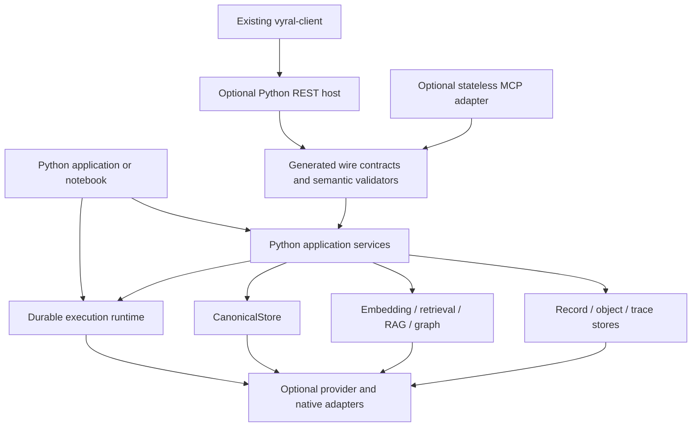

# Python Runtime Design

**Status:** accepted; full portable-local implementation complete at
`prototype`, preview qualification pending

**Date:** 2026-07-30

**Decision scope:** a Python-first implementation of Vyral's portable local
runtime, including embedded data and retrieval services, CanonicalStore, durable
execution, an optional REST host, and an additive stateless Model Context
Protocol (MCP) endpoint.

## Decision summary

Vyral will develop a Python runtime as a peer implementation of the Vyral
contract. It will not be a wrapper around the .NET process, a translation of
every C# source file, or a promise to reproduce every cloud and provider
adapter.

The target is the **full portable local profile**:

1. embedded records, collections, objects, traces, embeddings, retrieval, RAG,
   GraphRAG, inspection, evaluation, import, and export;
2. the strong CanonicalStore transaction, revision, fence, outbox, archive, and
   migration profile;
3. Python-native execution handlers and a SQLite-backed durable execution
   runtime with the same portable lifecycle, coordination, artifact,
   checkpoint, wait, recovery, and external-worker semantics as the local .NET
   adapter;
4. an optional REST host conforming to Vyral's public OpenAPI contract; and
5. an optional stateless MCP `2026-07-28` endpoint over the same application
   services.

Cloud stores, hosted orchestration engines, model providers, and CLI adapters
remain separately installed and separately qualified capabilities. A complete
Python runtime does not need to duplicate every .NET adapter to claim the local
profile.

Implementation will proceed conformance-first. Before implementing substantial
runtime behavior, Vyral will extract language-neutral scenarios and golden
vectors from the existing C# conformance suites. During bootstrap, the .NET
runtime is a differential oracle. Once both implementations pass the extracted
fixtures, OpenAPI, JSON Schema, the public operation catalog, and those fixtures
become the authority; neither implementation defines the contract by itself.

The Python runtime will be Python-first but not necessarily pure Python. Its
public API, installation, extension points, debugging experience, and ordinary
development workflow must be native to Python. Optional native wheels may
accelerate vector, tokenizer, SQLite, or ONNX work after measurement. Embedding
.NET through `pythonnet`, launching a hidden .NET sidecar, or requiring a .NET
installation does not satisfy this design.

## Implementation status

As of 2026-07-30, all delivery phases required for the portable local
implementation exist:

- Phase 0 packages and validates OpenAPI, JSON Schema, the 129-operation public
  SDK catalog, the 133-operation REST surface, and versioned language-neutral
  fixtures.
- Phase 1 implements SQLite records, queries, FTS5, exact vectors, snapshots,
  filesystem objects, traces, deterministic embeddings, retrieval, evaluation,
  RAG ingestion/context/prompts, graph import/export/traversal/doctor, and
  GraphRAG.
- Phase 2 implements the Python handler API and dependency-free external-worker
  transport. The unchanged example handler passes restart, durable wait,
  checkpoint, artifact, cancellation, token-redaction, and completion-replay
  gates against both the .NET server and the Python host.
- Phase 3 implements the strong SQLite CanonicalStore profile, including
  transactions, fences, revisions, idempotency, outbox leases, migrations,
  preflight, corruption rejection, hash-verified chunked archives, restart, and
  byte-identical .NET/Python archive goldens.
- Phase 4 implements native durable execution, recovery, retries, cancellation,
  concurrency keys, timers, events, waits, leases, artifacts, checkpoints,
  external workers, maintenance, execution policy, and all ten portable domain
  job adapters.
- Phase 5 implements a dependency-light ASGI REST host and the stateless MCP
  `2026-07-28` endpoint. REST routes are derived from OpenAPI and reach an
  implementation or explicit optional-adapter boundary. Clean runtime wheels
  pass the unchanged Python and JavaScript real-server consumers. A pinned
  `@modelcontextprotocol/conformance` `0.2.0-alpha.11` gate passes the complete
  frozen `--requirements 2026-07-28` profile, including the runner's extension
  and pending scenarios, with no failures.

Availability and maturity remain separate. Every required profile reports
`available: true`, but every profile remains `prototype` and
`fullLocalReady` remains false even though the manually gated Python 3.10–3.12
Linux/macOS/Windows matrix has produced a complete passing receipt. Promotion
still requires the remaining reviewed release evidence and independent
security review. The local SQLite/filesystem topology reports itself as
`local-single-node`; stateless MCP does not turn it into distributed storage.

Executable evidence is split by concern:

- `scripts/verify-python-runtime.sh` covers contracts, fixtures, branch-aware
  unit tests with a pinned measurement engine and 77.5% regression floor,
  strict typing, wheel/sdist contents, clean core installs, and the server
  extra.
- `scripts/test-built-sdk-python-runtime.sh` runs both maintained SDK consumers
  against a clean-wheel Python host.
- `scripts/verify-python-runtime-external-worker.sh` covers the real HTTP worker
  lifecycle and server restart.
- `scripts/verify-python-runtime-mcp-conformance.sh` pins the final protocol and
  official runner version, executes the complete frozen requirements profile,
  and retains runner results when an evidence directory is supplied.
- `scripts/verify-python-runtime-security.py` emits installed-wheel adversarial
  evidence for REST/MCP authentication and routing, parser corruption,
  path/token hygiene, future-schema rejection, and bounded-work defaults.
- `scripts/verify-python-runtime-upgrade.py` installs distinct baseline and
  candidate wheels, applies the forward storage migration, verifies all durable
  stores through the authenticated combined host, and restarts it twice.
- `scripts/benchmark-python-runtime.py` records a bounded 2,000-record,
  384-dimension, 20-job local smoke; it is qualification evidence, not a
  performance SLA. It runs in the manual qualification workflow rather than
  the release-integrity lane, and only enforces a wall-clock limit when a
  controlled runner supplies one explicitly.
- `.github/workflows/python-runtime-qualification.yml` is manual-only while the
  repository's automated expensive workflows are gated. It owns the 3×3
  platform matrix and packaged-host qualification. Every platform job uploads
  a receipt generated by `scripts/write-python-runtime-platform-receipt.py`
  with source, interpreter, SQLite/FTS5, artifact, contract, profile, and gate
  identities.

## Context

Vyral now has unusually strong prerequisites for another runtime language:

- [`contracts/public-sdk-surface.json`](../contracts/public-sdk-surface.json)
  catalogs 129 public semantic operations over the OpenAPI surface;
- [`contracts/schemas/vyral-public.schema.json`](../contracts/schemas/vyral-public.schema.json)
  contains the canonical JSON Schema 2020-12 models shared by OpenAPI, SDKs, and
  MCP;
- [`src/Vyral.Server/contracts/vyral.openapi.json`](../src/Vyral.Server/contracts/vyral.openapi.json)
  is an OpenAPI 3.1 wire contract;
- [`clients/python`](../clients/python) already establishes Python naming,
  generated types, transport errors, authentication, retries, pagination,
  artifact transfer, and execution helpers; and
- the local record, object, canonical, and execution implementations already
  run against reusable provider-neutral C# conformance bases.

The current Python package is intentionally a thin HTTP client. It provides
complete access to a running Vyral server but does not remove the need to
install or operate the .NET runtime. That is a sound remote-consumption story,
not the embedded Python experience expected by notebooks, local AI
applications, Python test suites, and Python-native agent workers.

The present local implementation also demonstrates why this is not just an SDK
generation project. Local records depend on SQLite transactions, FTS5,
metadata indexes, exact vector scans, stable filtering and ordering, opaque
continuation behavior, and migration logic. Retrieval and RAG add deterministic
chunking, hashing, embedding shaping, fusion, reranking, citations, traces, and
evaluation. CanonicalStore adds atomic fences, revisions, idempotency,
outbox leases, and hash-verified archives. The local execution runtime owns
durable runs, dispatch, retries, cancellation, leases, timers, events, waits,
artifacts, checkpoints, restart recovery, and external workers.

The design therefore treats a Python runtime as a new qualified execution
dialect of one contract rather than as a language-specific redefinition of
Vyral.

## Goals

- Let a Python application install and use Vyral locally without installing,
  launching, or embedding .NET.
- Offer idiomatic synchronous and asynchronous Python entry points for scripts,
  notebooks, services, tests, and workers.
- Preserve the same Vyral-owned wire models, semantic invariants, capability
  vocabulary, import/export envelopes, and maturity rules as the .NET runtime.
- Make behavior portable through executable, language-neutral conformance
  evidence rather than through implementation similarity.
- Support Python-native handlers without leaking .NET plugin types into Python
  code.
- Keep the existing lightweight HTTP client useful and independently
  installable.
- Make local correctness independent of optional native acceleration.
- Allow an optional Python REST/MCP host to run behind an ordinary non-sticky
  load balancer when its configured state adapters are themselves shared and
  distributed.
- Preserve Vyral's existing authorization, idempotency, bounded-work,
  redaction, qualification, and provider-honesty rules.

## Non-goals

- Rewriting every Vyral cloud, Temporal, CLI, model, or Microsoft integration
  in Python.
- Making Python or .NET the public ontology.
- Maintaining binary or raw SQLite-file compatibility between runtimes.
- Promising identical performance characteristics across runtimes or Python
  installations.
- Hiding a .NET process behind a Python facade.
- Replacing dedicated vector databases, workflow engines, or provider SDKs.
- Making MCP the internal service API or replacing REST/OpenAPI.
- Treating stateless MCP as evidence that records, tasks, leases, or
  authorization state are stateless.
- Promising exactly-once external side effects. Python handlers retain the same
  checkpoint and side-effect idempotency responsibilities as other Vyral
  handlers.
- Blocking the current public 0.x release on Python-runtime completion.

## Definition of the full portable local profile

The Python runtime will declare support by profile and contract version. It
must not use one broad "Python supported" flag while silently omitting
subsystems.

| Public capability group | Required for full local profile | Required implementation |
| --- | --- | --- |
| Server and contracts | Yes | Health, readiness, OpenAPI, public schema, capability and version disclosure |
| Collections and records | Yes | SQLite collection policy, CRUD, batch behavior, queries, search, inspection, import/export, and portable continuation semantics |
| Objects and artifacts | Yes | Safe filesystem-backed storage, metadata, conditions, bounded listing, streaming, and run-owned artifacts |
| Embeddings | Yes | Provider protocol, deterministic local provider, batching, shaping, diagnostics, and extension registration |
| Retrieval and RAG | Yes | Lexical, exact vector, hybrid, profiles, reranking seam, ingestion, context, prompts, citations, traces, and evaluation |
| Graph | Yes | Graph envelopes, import/export, preflight, traversal, inspection, doctor, and RAG expansion |
| Traces | Yes | Local persistence, bounded query/export/summary, and pruning |
| CanonicalStore | Yes | Atomic commits, revisions, fences, idempotency, outbox leasing/replay, migrations, preflight, archive export, and restore |
| Execution | Yes | Native Python handlers, durable local runs, retries, cancellation, history, artifacts, checkpoints, leases, timers, events, waits, restart recovery, maintenance, and external workers |
| Providers | Baseline only | Registry, capability/readiness/doctor/qualification contracts, deterministic local provider, and adapter extension seam |
| REST host | Yes | Wire-compatible operation surface with the same policies and limits |
| MCP | Yes, preview until independently promoted | Stateless discovery, resources, bounded tools, durable tasks, request context, and official conformance |
| Cloud and hosted adapters | No | Optional packages with independent capability and qualification evidence |

Some public job operations are projections over durable execution. They become
available only after the execution profile exists; a preliminary data/RAG
release may expose the corresponding synchronous operations while clearly
advertising the job capability as unavailable.

## Architectural principles

### One contract, multiple execution dialects

OpenAPI, canonical JSON Schema, the public SDK catalog, import/export envelopes,
and conformance fixtures are shared. Python can use idiomatic names and objects,
but it must not invent competing status values, request fields, defaults,
failure classes, authorization classes, or capability identifiers.

The runtime declares the contract version and profiles it implements. A client
can inspect readiness and effective capabilities before using optional
behavior. Unsupported capability is explicit; it is not a silent fallback with
different semantics.

### Conformance before translation

Implementation resemblance is not evidence of parity. A clean Python
implementation is acceptable when it produces the specified behavior. A
line-by-line port is unacceptable when Python JSON handling, clocks, SQLite,
Unicode, floating point, or concurrency cause observable differences.

The first implementation milestone is therefore a fixture format and runner,
not a record-store port.

### Python-first, native only where justified

The baseline distribution should install using ordinary Python packaging and
provide a correctness-complete local path. Native components are allowed when
they have maintained wheels for the supported platform matrix, expose bounded
failure behavior, and pass the same fixtures as the baseline path.

Native acceleration must not change result ordering, filter admission,
identifier generation, hashes, capability semantics, or exact re-score
behavior. Performance capabilities and limits may differ and must be reported.

### Public storage portability uses envelopes

The record and execution SQLite schemas are runtime-private. Python may choose
similar tables because the semantics are similar, but cross-runtime migration
uses public collection exports, graph envelopes, CanonicalStore tenant
archives, object copies, and execution-owned outputs where supported. Vyral
will not couple independent runtimes through undocumented database layouts or
migration histories. A Python database file must never be opened by the .NET
runtime, or vice versa; matching filenames and SQLite versions do not imply
binary compatibility.

### Local and distributed profiles remain distinct

SQLite plus local files is a local and small-deployment profile. Stateless HTTP
or MCP requests do not make those adapters distributed. A load-balanced Python
host may advertise distributed operation only when record, object, canonical,
task, and execution state are backed by qualified shared adapters and the
relevant multi-instance gates pass.

## Proposed architecture



REST and MCP call application services directly. The MCP adapter must not make
loopback REST calls, and the embedded API must not serialize through HTTP to
reach local services.

### REST operation governance

OpenAPI remains the route authority. The Python host maintains a declarative
operation-family registry with exactly one implementation owner for every
OpenAPI operation id. Tests require the registry, OpenAPI-derived router, and
all 133 current operations to match exactly and exercise dispatch far enough to
reach an operation-specific implementation or validator. Adding an OpenAPI
operation without assigning an implementation family, assigning one operation
twice, or retaining a removed operation fails the host suite.

Domain implementations may remain in separate modules or be split further as
they grow; `rest_operations.py` is orchestration, not a second operation
catalog. Prefix matching is not an ownership mechanism.

## Package and module shape

The existing `vyral-client` distribution remains the thin remote client with
its current dependency-light posture.

The runtime ships as the `vyral` distribution. Its import package remains
`vyral_runtime`, preserving a clear distinction from the lightweight
`vyral-client` remote SDK. The logical modules are:

```text
contracts       generated wire types, codecs, constants, and semantic validators
local           SQLite/filesystem stores, migrations, diagnostics, and composition
embeddings      provider protocols and deterministic local implementations
retrieval       retrieval profiles, scoring/fusion, reranking, and evaluation
rag             ingestion, context, citations, prompts, and GraphRAG
canonical       CanonicalStore contracts and local implementation
execution       Python handler API, worker client, and durable runtime
server          optional REST/ASGI host, policies, and readiness
mcp             optional stateless MCP adapter
providers       provider registry, local target, and extension protocols
```

Packaging rules:

- the remote client must not depend on the runtime;
- the runtime must not reuse the HTTP client as its internal service layer;
- generated wire types in both distributions come from the same schema
  generator and are checked for contract-version and generation drift;
- server, MCP, ONNX, and native acceleration dependencies are optional extras;
- importing core contracts or opening the deterministic local engine must not
  import heavyweight model or server frameworks;
- provider packages depend on the provider-neutral runtime protocol, not the
  inverse; and
- distribution versions may mature independently, but every artifact records
  the public contract versions and runtime profiles it supports.

The first runtime release may be `0.1.x` while implementing the product's
`0.3.x` contract. Matching version numbers must not imply matching maturity.

### Repository ownership and extraction threshold

The Python implementation remains under `runtimes/python` while the portable
contract and qualification boundary are still being established. The `vyral`
repository is canonical for product semantics: OpenAPI, public JSON Schema,
the SDK catalog, language-neutral fixtures, and cross-runtime qualification.
The Python directory is currently canonical for the Python implementation; its
source must not be mirrored into a second repository.

A future `vyral-python` repository is appropriate only after all of these are
true:

1. `vyral` publishes an immutable contract bundle containing the three public
   contracts, conformance schemas and scenarios, versions, and cryptographic
   digests;
2. the Python repository pins and verifies one exact bundle and can build,
   test, type-check, package, secure, upgrade, and run its platform matrix
   without a sibling `vyral` checkout;
3. `vyral` can run cross-dialect qualification against a pinned Python wheel
   and retain its digest without importing Python source;
4. a contract change and a runtime upgrade have both been rehearsed across the
   repository boundary; and
5. issue ownership, security advisories, release authority, and compatibility
   policy are explicit for both repositories.

After extraction, `vyral-python` becomes the sole source of truth for Python
implementation code while `vyral` remains the sole source of truth for
portable semantics and conformance. Git submodules, duplicated source trees,
and mutable branch references do not satisfy this boundary.

## Python API design

### Wire types and runtime models

The generated `TypedDict` and `Literal` models remain useful at serialization
boundaries. They do not by themselves enforce runtime invariants.

The runtime will:

- accept schema-shaped mappings and idiomatic Python value objects at public
  boundaries;
- reject unknown or invalid semantic shapes without silently coercing values;
- normalize into internal immutable value objects where an operation requires
  identity, hashing, ordering, transaction, or lifecycle invariants;
- serialize only through shared codecs derived from the public schema; and
- keep hand-written semantic validation for rules that JSON Schema cannot
  express, such as collection-policy compatibility, execution lifecycle
  transitions, idempotency fingerprints, vector-policy agreement, and
  cross-field authorization scope.

Embedded operations return rich runtime models when callers benefit from
identity, invariants, or methods. Callers serialize those models with
`to_dict()` at HTTP, MCP, queue, or persistence boundaries; Python class names
and private object layout are not portable contract. OpenAPI operation ids
remain the semantic naming authority. Idiomatic `snake_case` embedded names
should mirror them where practical, and a Python-only convenience name must not
introduce different defaults, coercion, validation, or failure semantics.

A heavyweight validation framework is not required by the core package.
Generated structural checks and explicit semantic validators are preferred so
that Python and .NET do not acquire different coercion rules.

### Synchronous and asynchronous use

The embedded local engine needs first-class synchronous APIs for scripts,
notebooks, tests, and data preparation. It also needs asynchronous APIs for
providers, servers, and execution handlers.

The storage core will keep transactions synchronous and connection-scoped. An
asynchronous facade submits complete blocking storage operations to a bounded,
runtime-owned executor. It must not hold a SQLite transaction open across an
arbitrary `await`, move one connection between unrelated threads, or create an
unbounded `to_thread` task per record.

Network embedding/provider calls and Python execution handlers may be natively
asynchronous. Batch and higher-level services coordinate those calls with
explicit concurrency limits and cancellation propagation.

The sync facade must not start and stop a hidden event loop per operation or
call `run_until_complete` on a notebook's active loop. Shared business logic
lives below both facades rather than one facade invoking the other through
fragile event-loop bridging.

### Handler authoring

Python handlers use an idiomatic protocol with an asynchronous execution method
and a Python run context. The context exposes the same portable operations as
`IExecutionRunContext`: progress, trace events, artifacts, checkpoints,
coordination leases, timers, external events, and durable waits.

The recommended authoring surface is `@vyral(...)` plus
`execution_plugin(...)`. The concise decorator keeps the durable handler and
plugin identifiers explicit, but derives display metadata and compiles an
ordinary synchronous or asynchronous callable into the same
`ExecutionHandlerDescriptor` and `DelegateExecutionHandler` used by explicit
registration. It is convenience syntax only: it does not introduce a workflow
graph, scheduler, retry engine, or second execution contract. The descriptive
`execution_handler(...)` spelling and explicit constructors remain available
for dynamic registration and framework integration.

Payloads, results, tags, and checkpoints remain plugin-owned JSON. The runtime
validates the execution envelope but does not reinterpret a plugin's domain
schema. Handler side effects remain replay-safe and idempotent responsibilities
of the plugin author.

The first handler release will use the external-worker protocol against an
existing Vyral server. This validates Python handler ergonomics and worker
replay behavior before the Python scheduler is implemented. The same handler
protocol will later run in-process under the Python local runtime.

## Local data, retrieval, and RAG

### SQLite and filesystem profile

The baseline local profile uses SQLite for records, indexes, traces, canonical
state, and execution projections, with filesystem storage for objects and
large artifacts.

Startup performs capability and integrity checks for:

- SQLite version and required transaction features;
- foreign-key enforcement, busy timeout, journal mode, and quick check;
- FTS5 and the required tokenizer behavior;
- writable database and object roots;
- schema and migration compatibility; and
- configured vector, embedding, and model capabilities.

If required FTS behavior is unavailable, readiness fails or the runtime
advertises a separately qualified reduced profile. It must not silently replace
phrase or token behavior with substring matching.

Paths, object names, metadata keys, and temporary files receive the same
portability and traversal checks as the current object-store contract.
Material writes use atomic replacement where supported, and incomplete
temporary artifacts are never listed as committed objects.

### Deterministic behavior

Shared golden vectors will cover:

- canonical JSON and idempotency fingerprints;
- SHA-256 identifiers, content hashes, plan hashes, prompt hashes, and archive
  hashes;
- Unicode normalization, lexical tokenization, stop words, required phrases,
  and JSON scalar boundaries;
- vector byte order, dimensions, distance functions, exact scores, and stable
  tie-breaking;
- chunk spans, chunk identifiers, manifests, deletion plans, and vector reuse;
- retrieval fusion, reranking inputs, result ordering, citation ordering, and
  evaluation metrics;
- timestamps, revisions, ETags, tombstones, and continuation invariants; and
- graph envelope identity, traversal order, bounds, and contribution
  summaries.

Floating-point conformance will distinguish exact serialization and stable
ordering requirements from tolerance-based numerical comparisons. Accelerated
candidate generation must retain an exact final score/order path where the
profile requires it.

The deterministic provider is the first required embedding implementation.
ONNX and external providers are optional adapters with independent doctor,
readiness, and qualification evidence.

## CanonicalStore

CanonicalStore is implemented as one strong profile, not as partial CRUD with
later transactional promises. Promotion requires:

- atomic document, fence, revision, transaction, and outbox commits;
- canonical idempotency fingerprints and conflict rejection;
- conditional writes and tombstones;
- tenant isolation and bounded indexed queries;
- lease, renewal, acknowledgement, release, dead-letter, and replay behavior;
- hash-verified tenant archive export and restore;
- migration receipts and isolated data-plane preflight; and
- concurrent transaction and restart tests.

Python and .NET archive envelopes must be mutually importable even though their
database files and migration tables need not be.

## Durable execution

The Python execution runtime will implement the portable local adapter rather
than a reduced background-task abstraction. Its required capabilities are:

- local dispatch and native Python handlers;
- durable runs and scheduled work;
- retries, timeouts, cooperative cancellation, and terminal-state stability;
- handler/plugin/payload idempotency;
- bounded status, history, result, and artifact projections;
- checkpoints, coordination leases, timers, external events, and durable
  waits;
- restart recovery with documented possible handler re-execution;
- run-owned artifact and retention behavior;
- external-worker lease, heartbeat, progress, event, artifact, checkpoint,
  wait, and replay-safe completion;
- maintenance status, dry-run pruning, and dispatch reconciliation; and
- caller/product/tenant policy parity at the service boundary.

SQLite transactions protect state transitions. Dispatch occurs only after the
state transition is durable, with reconciliation covering an interrupted
state-write/dispatch boundary. A concurrency key serializes running work under
the advertised local policy. Lease tokens are opaque bearer secrets and never
appear in URLs, ordinary logs, or trace details.

Python's global interpreter lock is not treated as a durable scheduling
primitive. The local runtime is optimized for local I/O-bound handlers.
CPU-intensive work uses explicit process isolation, an external worker, or a
provider runtime. Concurrency, queue, and executor limits appear in runtime
status and readiness.

## REST and stateless MCP host

The optional Python server exposes the same OpenAPI operation identifiers,
request/response models, problem details, authentication seams, policy classes,
limits, and idempotency requirements as the existing server. Framework-native
request objects must not enter application-service or provider contracts.

The MCP adapter follows
[`design/public-sdk-surface-and-stateless-mcp.md`](public-sdk-surface-and-stateless-mcp.md):

- one self-describing request per POST;
- no MCP session id, initialization dependency, sticky routing, or
  process-local caller state;
- protocol, method, resource/tool/task, routing, and authorization-relevant
  metadata resolved per request;
- strict header/body agreement and bounded headers/bodies;
- gateway routing and early rejection allowed, while Vyral remains the final
  authorization authority;
- request-scoped identity and policy captured into durable task state without
  storing raw credentials;
- long work mapped to durable execution rather than an open HTTP connection;
  and
- REST retained for binary upload, automation, and operations that are
  deliberately not MCP tools.

The MCP catalog remains read-only by default. Durable product task tools require
an explicit allowlist and the native execution profile; the conformance-only
fixtures are available solely through the explicit diagnostics switch.

Plain-load-balancer support requires two separate claims:

1. the protocol boundary is stateless and any instance can parse and authorize
   the request; and
2. the configured application services use shared, multi-instance-qualified
   state adapters.

The first claim does not imply the second. A SQLite host advertises local mode
and is not promoted as a distributed MCP deployment.

## Conformance system

### Language-neutral fixture format

Phase 0 introduces a versioned fixture tree containing:

```text
manifest.json
contracts/
goldens/
  canonical-json/
  hashes/
  lexical/
  vectors/
  rag/
  graph/
scenarios/
  records/
  objects/
  canonical/
  execution/
  external-workers/
  rest/
  mcp/
```

Each scenario declares:

- fixture and required contract versions;
- required capability profile;
- initial state and deterministic clock/random inputs where needed;
- ordered operations with schema references;
- expected values, errors, state transitions, and stable ordering;
- normalization rules for adapter-owned opaque values;
- restart, concurrency, or fault-injection steps; and
- cleanup expectations.

Fixtures contain no C# or Python type names. Opaque continuation tokens, lease
tokens, timestamps derived from an injected clock, and adapter-specific
diagnostics are tested by invariants unless their exact bytes are public.

### Test layers

Both runtimes must pass:

1. schema and operation-catalog consistency;
2. generated-type and codec drift checks;
3. in-process store and service scenarios;
4. black-box REST scenarios;
5. cross-runtime import/export tests;
6. differential golden workloads;
7. restart, cancellation, concurrent-write, lease-expiry, and dispatch
   reconciliation cases;
8. property and fuzz tests for parsers, filters, paths, and lifecycle
   transitions;
9. package-consumer tests from a clean virtual environment; and
10. the official MCP conformance runner plus Vyral authorization, limits,
    durable-task, and two-instance fixtures.

Differential testing is a bootstrap aid, not the final specification. When the
implementations disagree, maintainers resolve the behavior against the public
contract and reviewed fixture, then update both implementations or explicitly
version the contract.

### Fixture change policy

Every change to observable portable behavior—accepted fields and values,
defaults, ordering, pagination, hashes, failure classes, lifecycle transitions,
authorization classes, or import/export envelopes—must do one of the
following:

- add or update a language-neutral fixture that passes the Python and .NET
  dialects;
- cite an existing fixture that already distinguishes the changed behavior; or
- record a reviewed exception explaining why the behavior is deliberately
  runtime-specific and how capability/readiness disclosure prevents a false
  portability claim.

Fixture descriptors are content-addressed. An existing released fixture is
immutable; semantic corrections require an explicit fixture-version decision,
and additions must update the manifest, both dialect runners, packaged runtime
resources, artifact-layout checks, and cross-runtime tests in the same change.
The initial high-churn set covers compound record filters and continuations,
RAG chunk/manifest/plan hashes, execution rejection/failure/retry/cancellation,
restart-safe waits, and graph record mapping. Next priorities are prompt and
context hashes, graph truncation, lease expiry, concurrent write conflicts, and
additional recovery boundaries.

### Qualification and maturity

Python profiles use the repository's existing `prototype`, `preview`, and
`public` meanings from the [stability policy](../docs/reference/stability.md).

- A subsystem starts as `prototype` while its contract and fixtures are being
  extracted.
- It becomes `preview` after its full portable scenario set passes on the
  supported Python/platform matrix and limitations are documented.
- It becomes `public` only after package-consumer examples, release gates,
  security review, import/export interoperability, and maintained compatibility
  policy are in place.

The aggregate Python runtime remains `preview` until every required full-local
profile row is at least preview and the combined restart/upgrade gate passes.
One subsystem's maturity does not promote an optional provider adapter.

## Security and tenancy

The Python runtime preserves the existing trust boundaries:

- authentication establishes identity; tenant, product, handler, provider, MCP,
  and routing fields never authenticate a caller by themselves;
- authorization is enforced at the service boundary for embedded hosts as well
  as REST/MCP calls;
- shared deployments expose caller-effective capabilities instead of global
  provider, plugin, handler, or policy inventories;
- API keys, bearer tokens, lease tokens, provider credentials, signed cursors,
  and model credentials are redacted from logs and traces;
- query filters are compiled through bounded parameterized plans;
- JSON, vector, text, graph, artifact, trace, page, batch, retry, and
  concurrency limits are enforced before expensive work;
- archives and imports reject path traversal, credential-bearing URIs,
  incompatible contracts, corrupt hashes, and partial state unless a reviewed
  option explicitly permits it; and
- durable task authorization stores the minimum request-context snapshot needed
  to reauthorize later work, not raw transport headers.

Security parity tests run through embedded services and the optional hosts so
that a correct HTTP policy cannot conceal an unsafe in-process default.

## Observability and readiness

### Asset verification lifecycle

Loading the embedded runtime always validates the bundled contract resources.
Ordinary `VyralRuntime()` construction does not run the complete golden corpus;
callers that require this fail-closed behavior opt into
`VyralRuntime(verify_assets=True)`. Readiness remains an authoritative golden
self-test, the owned REST/MCP host opts in during composition, and release
qualification executes the canonical fixture runner independently. This avoids
making every notebook object or test fixture pay an ever-growing conformance
cost while preserving explicit integrity gates.

Readiness reports:

- runtime, package, contract, schema, and migration versions;
- enabled profiles and explicit unavailable capabilities;
- SQLite/FTS/filesystem diagnostics;
- embedding/model/provider doctor results;
- execution queue, concurrency, recovery, and maintenance state;
- MCP mode and task-store durability class;
- acceleration mode and relevant native library versions;
- warnings and blockers without secrets or caller-specific inventories; and
- qualification artifact identities.

Traces preserve Vyral's bounded, low-cardinality operational shape. Python
exception types and stack traces may appear in local debug output but are not
portable failure classes and are not returned to untrusted callers by default.

## Performance and packaging qualification

Correctness is the first gate; accessibility also requires predictable
installation and adequate local performance.

The initial supported matrix should match the current Python client
(`3.10`–`3.12`) on maintained Linux, macOS, and Windows runners. Additional
Python versions become supported only after the same package, SQLite, ONNX, and
conformance gates pass.

Release qualification includes:

- clean source and wheel installation with no .NET runtime present;
- FTS5 capability verification on every supported base environment;
- startup and small-corpus notebook smoke tests;
- record ingestion, lexical, exact-vector, hybrid, RAG, and graph benchmarks at
  published local-profile sizes;
- memory and cancellation behavior for bounded batches;
- concurrent reader/writer and busy-timeout tests;
- process restart during ingestion and execution transitions;
- optional ONNX CPU and available accelerator wheel tests; and
- performance comparisons reported as runtime-specific evidence, not portable
  guarantees.

If the standard Python SQLite build cannot provide consistent required
features, the project will choose a maintained SQLite distribution strategy
with supported wheels. That decision is made from the Phase 0 platform spike,
not assumed from one developer workstation.

## Delivery sequence

### Phase 0 — Contract and conformance foundation

Deliver:

- the reviewed full portable local profile and capability identifiers;
- final distribution/import naming and supported platform matrix;
- generated contract/codecs skeleton;
- language-neutral fixture schema and runner;
- golden JSON, hash, lexical, vector, RAG, graph, and lifecycle vectors;
- C# adapters that run the extracted scenarios; and
- a minimal Python package exposing version, capability, and readiness
  information.

Exit gate: the current .NET local implementations pass the extracted fixtures
without relying on C#-specific fixture semantics, and the Python package can
load and validate the contract bundle in a clean environment.

### Phase 1 — Embedded local data, retrieval, and RAG

Deliver:

- SQLite records, collections, metadata filters, FTS, vectors, and
  continuation;
- filesystem objects and SQLite traces;
- deterministic embeddings and provider extension protocol;
- retrieval profiles, lexical/vector/hybrid search, reranking seam, evaluation,
  and inspection;
- RAG ingestion, manifests, planning/commit drift checks, context, citations,
  and prompts;
- GraphRAG import/export, traversal, inspection, doctor, and evaluation;
- collection import/export interoperability with .NET; and
- sync and async embedded facades.

Exit gate: data/RAG conformance, cross-runtime export/import, deterministic
goldens, packaging, security, and published-size performance gates pass on the
supported platform matrix.

This is the first developer-facing preview and the first material accessibility
milestone.

### Phase 2 — Python handler authoring and external worker

Deliver:

- Python handler/plugin descriptors and run context;
- external-worker lease loop, heartbeat, progress, events, artifacts,
  checkpoints, durable waits, completion, cancellation, and token hygiene;
- local testing harness for handlers; and
- examples running the same Python handler against the .NET local server and a
  disposable remote worker topology.

Exit gate: the shared external-worker conformance suite and replay-safe
completion/restart scenarios pass without handler changes.

This phase lets Python developers own executable Vyral work before Vyral
reimplements durable scheduling in Python.

### Phase 3 — CanonicalStore

Deliver:

- the strong local transactional profile;
- outbox lease/recovery and migration support;
- tenant archives and .NET/Python round-trip fixtures;
- preflight and storage diagnostics; and
- embedded authorization seams.

Exit gate: all CanonicalStore scenarios, concurrency/fault cases, archive
interoperability, migration, and isolated preflight pass.

### Phase 4 — Native durable execution

Deliver:

- SQLite run state and artifact projection;
- native handler registration and bounded dispatch;
- retries, cancellation, timers, events, waits, leases, checkpoints, and
  recovery;
- external-worker runtime compatibility;
- pruning and reconciliation; and
- domain job adapters for embeddings, retrieval evaluation, RAG ingestion,
  graph work, records, and providers.

Exit gate: the full execution and external-worker suites pass, including
restart, idempotency, concurrency, fault injection, durable waits, maintenance,
and mixed in-process/external-worker workloads.

### Phase 5 — REST and stateless MCP

Deliver:

- the optional ASGI REST host over application services;
- public operation-catalog coverage and real-server Python/JavaScript client
  tests;
- stateless MCP discovery, resources, tools, and durable tasks;
- gateway header agreement, request limits, authentication, effective-policy,
  and redaction behavior; and
- single-instance local and two-instance shared-state deployment fixtures.

Exit gate: OpenAPI/catalog coverage, both existing HTTP SDK consumer suites,
official MCP conformance, Vyral MCP integration fixtures, and durable task
resumption pass at the same release commit.

### Phase 6 — Optimization and optional adapters

Deliver only from measured demand:

- native vector/tokenizer/index acceleration;
- ONNX embedding and reranking extras;
- selected Python-native provider targets;
- selected shared storage or execution adapters; and
- broader Python/platform support.

Each adapter or accelerator has independent capability, fallback, security,
performance, and qualification evidence. Phase 6 is not required to call the
portable local profile complete.

## Release and compatibility policy

- The Python runtime declares its supported public contract, fixture, and
  profile versions in package metadata and readiness.
- Generated contract drift fails CI.
- Public Python APIs follow the repository's 0.x compatibility policy; breaking
  changes require a minor release and migration notes.
- Runtime-private schema migrations are forward-only within a supported minor
  line and are tested through upgrade/restart fixtures.
- Public export envelopes remain the cross-runtime migration boundary.
- A new portable capability is not described as Python-supported until its
  fixtures pass. The .NET product may advance independently, but support
  matrices must show the exact contract/profile version rather than implying
  latest parity.
- Release evidence records Python version, operating system, SQLite/native
  versions, contract version, fixture version, commit, enabled profiles, and
  test results.

## Risks and mitigations

| Risk | Mitigation |
| --- | --- |
| Python becomes a second interpretation of Vyral | Extract language-neutral fixtures first; generate wire types; resolve differences against reviewed contracts |
| Scope expands into every adapter | Define full as the portable local profile; keep cloud/provider adapters independently optional |
| Current C# tests conceal implementation assumptions | Make the .NET runtime pass data-driven fixtures and black-box tests before using them as Python gates |
| Python/SQLite/Unicode differences change behavior | Pin golden vectors, probe runtime capabilities, record versions, and fail readiness rather than silently degrade |
| Pure Python vector or lexical work misses usable limits | Preserve a correct bounded baseline; introduce qualified native acceleration behind unchanged semantics |
| The global interpreter lock is mistaken for workflow isolation | Bound local concurrency and support processes/external workers for CPU-heavy handlers |
| Users confuse the HTTP client and runtime | Keep distributions separate and document remote, embedded, server, and worker entry points explicitly |
| MCP statelessness is mistaken for distributed durability | Advertise state-adapter topology separately and require multi-instance task/state gates |
| Dual-runtime maintenance slows contract evolution | Version supported profiles explicitly; require shared fixtures for promoted portable behavior |
| Optional dependencies make installation fragile | Keep extras isolated, test clean wheels, and qualify a small supported platform matrix before expanding |

## Acceptance criteria for a full Python runtime

The runtime may be described as implementing the full portable local profile
only when:

1. every required row in the profile table passes the language-neutral
   conformance suite;
2. .NET and Python exchange collection, graph, and CanonicalStore archives
   without private database access;
3. Python handlers pass in-process and external-worker lifecycle, replay,
   checkpoint, artifact, wait, cancellation, and restart cases;
4. the REST host covers the public operation catalog and passes the existing
   Python and JavaScript real-server consumers;
5. the MCP endpoint passes the official `2026-07-28` runner and Vyral's
   authorization, request-limit, durable-task, and two-instance tests;
6. clean supported-platform installations work with no .NET runtime present;
7. readiness accurately reports unavailable optional adapters, native
   capabilities, and local-versus-distributed topology;
8. security, corruption, upgrade, recovery, and bounded-work gates pass; and
9. stability and qualification records make no stronger claim than the
   evidence.

### Current evidence against acceptance

| Criterion | Current result |
| --- | --- |
| Required portable subsystems | Implemented and covered by shared fixtures plus Python subsystem tests |
| Collection, graph, and CanonicalStore portability | Shared language-neutral envelopes and exact Python/.NET golden hashes pass; private databases are not exchanged |
| Native and external Python handlers | In-process and real-HTTP lifecycle, wait, checkpoint, artifact, cancellation, restart, and replay gates pass |
| REST and maintained SDKs | All 133 routes are wired; clean Python and JavaScript package consumers pass against the packaged Python host |
| MCP `2026-07-28` | The packaged Python host passes the pinned alpha.11 runner's complete frozen `--requirements 2026-07-28` profile with 189 checks and no failures; diagnostic fixtures remain explicitly test-only |
| Clean installation without .NET | Wheel, sdist, server-extra, conformance, a pinned 77.5% combined line/branch regression floor, and strict typing gates pass locally; the manually gated Python 3.10–3.12 Linux/macOS/Windows matrix has a complete passing receipt |
| Readiness honesty | Implemented profiles are available but remain prototype; topology is explicitly local single node and optional providers remain unavailable |
| Security/recovery/bounded work | A 28-case installed-wheel adversarial gate and the `0.1.0` → `0.1.1` schema/combined-host restart rehearsal pass locally; combined-host startup/shutdown rollback, archive chunk-count bounds, redaction, owned-runtime closure, and cancellation propagation are directly tested; independent security review remains a promotion gate |
| Stability/qualification claim | The aggregate remains prototype and `fullLocalReady: false` |

## Immediate next actions

1. Preserve the generated performance, security, upgrade, package identity,
   platform, and MCP runner JSON as reviewed release evidence.
2. Run an independent security review of host authentication, archive/import
   parsers, worker bearer-token handling, MCP header routing, and bounded-work
   defaults.
3. Review the completed `0.1.0` → `0.1.1` installed schema upgrade and combined
   host restart receipt with the other promotion evidence.
4. Add optional native acceleration or shared/distributed adapters only through
   Phase 6's independent qualification rules.

## Related decisions

- [Security policy](../SECURITY.md)
- [`design/public-sdk-surface-and-stateless-mcp.md`](public-sdk-surface-and-stateless-mcp.md)
- [`design/portable-runtime-qualification-and-temporal-adapter.md`](portable-runtime-qualification-and-temporal-adapter.md)
- [`design/execution-runtime.md`](execution-runtime.md)
- [`design/execution-runtime-plugin-authoring.md`](execution-runtime-plugin-authoring.md)
- [Stability policy](../docs/reference/stability.md)
